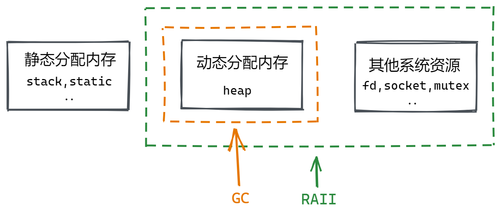

# RAII与资源管理

如果要给计算机史上最糟糕的技术词汇命名弄一个排行榜的话，由C++之父创造的RAII[^1]肯定榜上有名。首先是发音问题，到底该念Ray? Rai? 还是R.A.I.I呢？没有人知道。其次，作为一种有关资源获取和释放的管理机制，其全称**资源获取即初始化**(Resource Acquisition is Initialization)只描述了RAII机制关于资源初始化的部分，而事实上更为关键的**资源释放即析构**(Resource Release is Destruction)却选择性地被忽略了，导致很多像我这样的小白刚接触的时候就被其高大上唬住了，不敢知其所以然。

为了更好地理解RAII机制，我们先来聊聊什么是资源。资源是一个很宽泛的概念，在不同的语境下有不同的含义，我们上面提到的资源实际上是指操作系统提供给应用程序的内存、文件句柄、socket和锁等数量有限的东西，这里为方便理解我们从资源管理方式角度将其分为以下三类：



第一类是静态分配的内存，比如栈内存、全局变量区内存和静态变量区内存等。这类内存该分配多少，以及怎么分配和释放（程序运行一开始由系统分配，程序结束时才会被释放）是由编译器在编译和链接阶段确定的，不需要用户手动管理。由于Rust的内存模型目前还未稳定下来[^2]，这里也就不具体展开来说了。

第二类是系统在运行时根据程序的需要动态分配的堆内存等。这类内存由程序自行申请，用完后需要手动释放，否则会导致内存泄漏的问题。
这类内存一般比其他内存大且无序，管理起来很麻烦，因此Go、Java等比较偏应用层的静态类型语言和绝大部分动态类型语言都选择引入GC来进行自动管理，让开发者可以更专注于应用逻辑。GC不好的地方在于会带来运行时的性能开销和STW[^3]的问题，对于C++、Rust等比较偏底层且注重性能的语言来说是完全不可接受的，因此都选择引入RAII机制。虽然GC和RAII都能自动管理堆上内存，减轻开发者的心智负担，但是两者的思想是很不一样的，这个我们留后面再讲。

第三类是诸如文件句柄/描述符、锁、socket等从操作系统获取的资源，这类资源必须由用户显示地关闭才能被操作系统回收，单单清除内存里的资源持有对象仍然可能会导致内存泄漏（甚至可能导致更严重的影响程序逻辑的错误，如忘记释放锁而导致死锁问题）。GC的引入可以让开发者从内存管理中解脱出来，但对于这类资源的管理就无能为力了。

RAII要解决的问题，就是让第三类资源和第二类内存的处理方式统一起来，具体来说就是：

- Resource Acquisition is Initialization: **在持有对象被初始化时完成资源的分配**
- Resource Release is Destruction: **在持有对象被析构时完成资源的释放**

通过这种将资源的生命周期和持有对象的生命周期强绑定的方式，RAII保证了只要对象能被正确地析构（内存安全），就不会出现资源泄漏的问题（资源安全）。同时，作为一种比GC更通用的资源管理机制，RAII还有另一个不可忽视的特性，那就是可以很好地保证代码的异常安全性。例如在下面Non-RAII的代码中（我们这里假设Rust没有RAII机制），一个异常如果发生在锁申请和锁释放之间的话，释放锁的语句即使有写也不会被执行，进而导致资源泄漏和死锁双重问题的出现。

```rust,no_run
// non_raii.rs
# #![feature(mutex_unlock)]
# use std::sync::Mutex;

fn main() {
    let mutex = Mutex::new(0); // 构造/申请一个Mutex对象

    let mut guard = mutex.lock().unwrap(); // 上锁并获取MutexGuard

    // 这里出现了异常！（可以理解为Java、C++的异常，或Rust的Panic、Error）

    Mutex::unlock(guard); // 因为出现了异常，这里的解锁语句不会再执行了
}
```

对于像Rust这样支持RAII的语言，即使发生了异常，Mutex也会被在栈展开[^4]的过程中被析构，保证了异常安全。

```rust,no_run
// raii.rs
# use std::sync::Mutex;

fn main() {
    let mutex = Mutex::new(0);

    let mut guard = mutex.lock().unwrap();

    // 这里出现了异常！

    // 当离开作用域时，mutex会被自动析构 (不管是否抛出了异常)
}
```

相对的，对于GC语言来说，为了保证资源管理的异常安全，通常的办法是提供一个不管是否发生异常都会执行的语句，来确保资源在出现异常的情况下也能被正确地释放，比如Java中的finally语句和Golang中的defer语句。以下是一个在Java中用finally来释放socket的例子：

```java
// finally.java

void foo() {
    Socket socket;
    try {
        socket = new Socket();
        access(socket);
    } finally {
        socket.close(); // 不管有没有发生异常这里都会执行
    }
}
```

可见对于GC语言来说，为了保证第三类资源的内存安全和异常安全，开发者需要在(1)特定的语句中(2)显式地释放资源，但是第二类内存资源却是不需要手动释放的，这样割裂势必会导致即使开发者足够有经验，也可能写出内存泄漏代码，毕竟百密一疏，在所难免嘛。

## Rust中RAII的实现方式

TODO：

- Rust enforces RAII
- RAII和所有权机制完美契合
- 通过Drop Trait实现
- 通过Move语义和drop()可提前释放资源，不必等到函数结束

## 为什么GC语言不能实现RAII

TODO:

- 待思考和查阅资料

### 参考资料

[^1]: [https://en.wikipedia.org/wiki/Resource_acquisition_is_initialization](https://en.wikipedia.org/wiki/Resource_acquisition_is_initialization)

[^2]: [https://doc.rust-lang.org/stable/reference/memory-model.html](https://doc.rust-lang.org/stable/reference/memory-model.html)

[^3]: [https://en.wikipedia.org/wiki/Tracing_garbage_collection#Stop-the-world_vs._incremental_vs._concurrent](https://en.wikipedia.org/wiki/Tracing_garbage_collection#Stop-the-world_vs._incremental_vs._concurrent)

[^4]: [https://en.wikipedia.org/wiki/Call_stack#Unwinding](https://en.wikipedia.org/wiki/Call_stack#Unwinding)

[^5]: [https://doc.rust-lang.org/rust-by-example/scope/raii.html](https://doc.rust-lang.org/rust-by-example/scope/raii.html)
