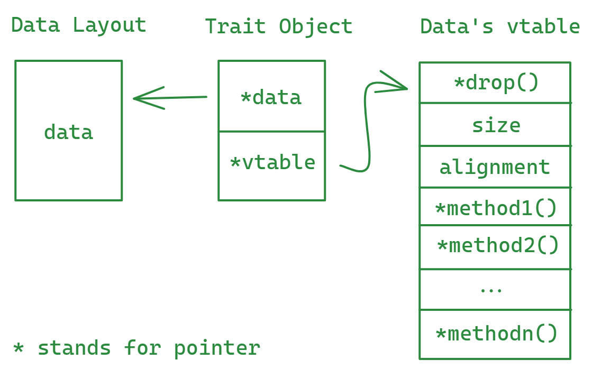

# 静态和动态分派

**多态**（polymorphism）这个概念相信各位都不陌生。当涉及多态调用时，需要有一种分派（dispatch）机制来确定实际运行哪个特定的实现（方法或函数）。分派机制有两种：编译时的**静态分派**（static dispatch）和运行时的**动态分派**（dynamic dispatch）。本文主要讨论这两种分派机制。

> 按照国际惯例，本文给出的大部分例子都是可以通过点击代码块右上角的右三角▶运行的。

## 静态分派

Rust的静态分派是通过编译期的**单态化**（monomorphization）来实现的， 请看下面例子：

```rust,no_run,noplayground
{{#include show_trait.rs}}
```

```rust
{{#rustdoc_include show_trait.rs:-1}}

// 注意参数x的类型是一个可以在编译期确定的类型`T`
fn show<T: Show>(x: T) {
    x.show();
}

fn main() {
    let x = "Hello ";
    let y = 42u8;

    show(x);
    show(y);
}
```

在上面的例子中，编译器会在编译期分别为`u8`和`&str`创建特化的`show()`函数，相当于生成了如下单态化的代码：

```rust
{{#rustdoc_include show_trait.rs:-1}}

fn show_str(x: &str) {
    x.show()
}

fn show_u8(x: u8) {
    x.show()
}

fn main() {
    let x = "Hello ";
    let y = 42u8;

    show_str(x);
    show_u8(y);
}
```

单态化的优点是可以内联函数调用，实现运行时的高性能，但同时也导致了代码膨胀和编译时间的增加，这也是Rust编译速度为什么特别慢的原因之一（编译速度目前应该还没有能打的...）。

## 动态分派

Rust的动态分派功能是通过trait对象（如`Box<dyn Show>`或`&dyn Show`）提供的。trait对象可以储存实现了该特性的的任意类型的值，但精确的类型只能在运行时确定。

回到上面的例子，我们也可以用trait对象来实现运行时的动态分派：

```rust
{{#rustdoc_include show_trait.rs:-1}}    

// 注意参数x的类型是一个`trait object`的引用，`dyn`的意思是需在运行时动态确定的
fn show(x: &dyn Show) {
    x.show();
}

fn main() {
    let x = "Hello ";
    let y = 42u8;

    show(&x as &dyn Show);
    show(&y as &dyn Show);

    // 或者更简单的写法：
    // show(&x);
    // show(&y);
}
```

使用trait对象的函数不会在编译期被单态化，而是通过在运行时调用较慢的虚函数来实现动态分派，因此有效地抑制了进行内联和相关优化的机会。

<!-- 值得提的一点是，将一个具体的类型转化为一个trait对象时，编译器不再具有该类型的特定知识，意味着你不能再调用非trait对象上的方法了，我们把这种现象叫做类型擦除（type erasure）。 -->

<!-- ```rust -->
<!-- {{#rustdoc_include show_trait.rs:-1}} -->

<!-- fn show(x: &dyn Show) { -->
<!--     x.show(); -->

<!--     let _ = x.to_uppercase(); -->
<!-- } -->

<!-- fn main() { -->
<!--     let x = "Hello "; -->

<!--     show(&x); -->
<!-- } -->
<!-- ``` -->

<!-- 在上面的例子中，调用`str`的`to_uppercase()`方法是非法的，因为编译器已经不知道`x`是`&str`了。 -->

你可以已经注意到，在上面动态分派的例子中，trait对象在传给函数的时候是以引用的形式传入的，这是因为trait对象大小是不确定的, 不能直接传入函数，因此加了一层indirection。`&dyn Show`是一个16字节大小的胖指针（fat pointer）, 前8个字节指向具体类型携带的数据，而后8个字节指向该具体类型对应的`vtable`。以下是`&dyn Show`的vtable可以用如下结构体表示：

```rust
struct ShowVtable {
    // 指向析构器的指针, 如果实现了`Drop`特性的话
    destructor: fn(*mut ()),
    // 数据的大小
    size: usize,
    // 数据的对齐要求
    align: usize,
    // 具体实现的函数指针
    // 可能有多个，但这里的`Show`特性只有一个方法
    show: fn(*const ()),
}
```

一个trait对象的内存布局如下图所示：




## 参考资料

[^1]: [https://doc.rust-lang.org/1.30.0/book/first-edition/trait-objects.html#trait-objects](https://doc.rust-lang.org/1.30.0/book/first-edition/trait-objects.html#trait-objects)

[^2]: [https://alschwalm.com/blog/static/2017/03/07/exploring-dynamic-dispatch-in-rust/](https://alschwalm.com/blog/static/2017/03/07/exploring-dynamic-dispatch-in-rust/)
